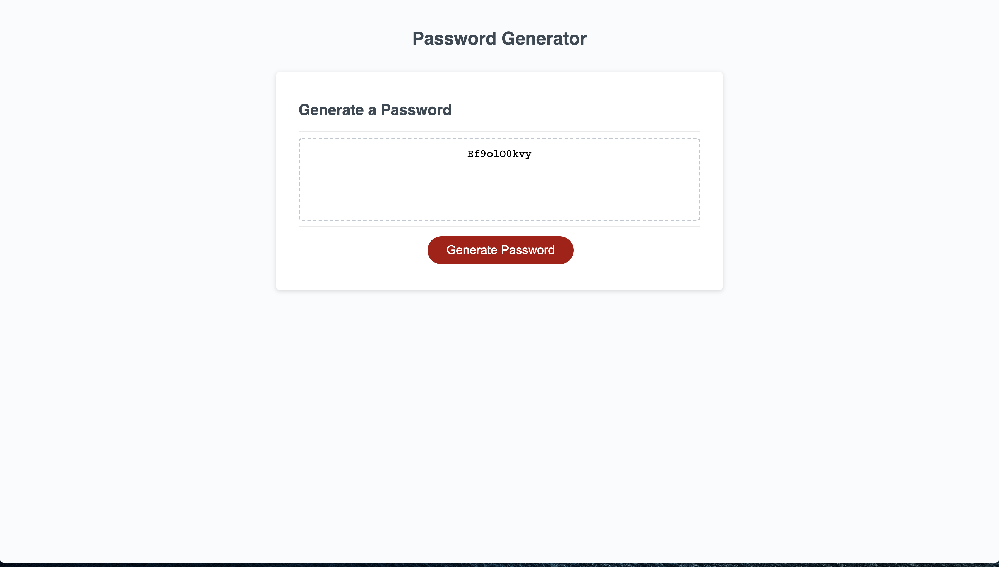

# 03 JavaScript: Password Generator
## Purpose
```
For employee with access to sensitive data. Employee may randomly generate a password that meets certain criteria. 
S0 that greater security can be provided by using a strong password.
For future emploer to reviews samles of my work and assess whether they're a good candidate for an open position
```

## Built With
```
- Html
- CSS
- JavaScript
```
## Website

[passWordGen URL](https://mr2447.github.io/password/)
[GitHub repo](https://github.com/mr2447/password)

## Contribution
```
Made with ❤ by Marvin Ren
```
## Screen Shot

